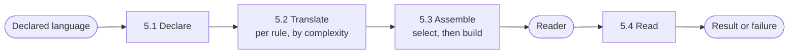

# Core Domain Distillation — Tiferet-Ly (Lex/Yacc Wrapper)

**Status:** Draft · **Domain:** `tiferet-ly` · **Code:** `tiferet_ly/` · **Branch:** `v1.x-proto`
**Companion:** `docs/domain-vision.md`

## 1. Purpose of this document
The vision statement says *what* Tiferet-Ly is for. This document says *how
the domain works*: the vocabulary, the principles those words carry, the
bounded steps that turn a declared language into a working reader, and the
way the pieces relate to each other and to the engine underneath.

It is the conceptual reference a later design should be measured against.
Where a technical term is unavoidable, it is defined once in Section 3 and
then used consistently.

## 2. The core domain, restated precisely
Tiferet-Ly's core domain is **turning a declared small language — its
vocabulary and its sentence structure — into a working reader for text
written in that language, by translating the declaration into the exact form
the underlying Lex/Yacc engine requires.**

That engine already does the hard work of recognizing words and sentence
patterns. It insists on being told the rules in a particular, code-shaped
way. Tiferet-Ly sits in front of that convention: a consumer declares a
language once, and this domain is responsible for producing whatever the
engine actually needs, correctly, every time.

The domain has one fixed shape:

> **Declare** → **translate** → **assemble** → **read**

and four axes of variation:

1. **Rule complexity** — whether a single word or sentence rule is pure
   declaration (a pattern, nothing else) or carries a small piece of
   executable logic alongside its pattern. This axis applies independently
   on both the lexical and the syntactic side.
2. **Lexical vs. syntactic** — whether a rule governs how raw characters are
   grouped into words, or how a sequence of already-recognized words is
   accepted as a valid sentence. The two sides share the complexity axis
   above but not the engine's own conventions, and not the same relationship
   to order (Section 4).
3. **Declared language** — which specific small language is being described
   in any one use of Tiferet-Ly. The wrapper itself must remain indifferent
   to this axis; nothing about translation, assembly, or reading may assume
   a particular language's vocabulary, grammar, or result shape.
4. **Grammar composition** — whether a rule belongs to one grammar or is
   reached through another grammar that extends it, and, when more than one
   parent contributes a same-named rule, which contribution wins. Rules stay
   flat and tagged with the one grammar they belong to; composition is a
   filter over those catalogues, never a nesting of rules inside grammars.

## 3. Ubiquitous language
**PLY** — the third-party Lex/Yacc engine that does the actual
word-recognition and sentence-recognition work. Not part of this domain;
treated as infrastructure whose conventions cannot be renegotiated.

**Token rule** — a declaration of how one *kind* of word is recognized: a
name, and either a raw pattern or a pattern plus an action. Distinct from
the recognized instance itself (a lexeme).

**Lexeme** — one recognized word: a name, a payload, and a source span
(line and position). It is what reading produces on the lexical side. It
is not a token rule. The same span is what a recognition failure names,
so a later tree does not invent a second way to say *where*.

**Grammar production** (production, for short) — a declaration of how a
sequence of tokens and/or other productions forms a larger structure. A
production name may repeat: each repetition is an alternative, not a
duplicate definition, and not a node type.

**Simple rule** — a token rule or production whose declaration is nothing
but its pattern. It carries no executable action of its own. A simple
production's result is a pass-through of its single recognized part.

**Complex rule** — a token rule or production whose declaration pairs a
pattern with an **action**: a small block of executable logic that runs
whenever the rule matches. The action is what builds a number, a list, a
tree node, or whatever else the language wants. It is part of the
declaration, compiled when the rule is translated.

**Grammar** — a named composition node for one declared language or
dialect: an identity, an ordered list of parent grammars it extends, and
the start-symbol production a reader begins from. A grammar does not
contain its rules. Each rule names the one grammar it belongs to.

**Grammar composition** — the relationship among grammars. A grammar may
extend one or more parents. Walking parents in declared order, recording
each grammar the first time it is reached, and treating the target grammar
as most precedent, yields one effective ancestor set. Between two
unrelated parents, the later-declared one wins ties; a rule the target
declares itself overrides a same-named rule an ancestor declared.

**Declared language** — the three catalogues taken together: grammars,
token rules, and productions. This is what a consumer writes. It is the
input to the Declare step. It is meaningful only as a whole.

**Docstring-carried pattern** — the engine's governing convention: it
does not read a token's or production's pattern from an argument or a
config value, it reads it from the documentation string attached to the
function (or, for the simplest tokens, from a plain string) that
represents the rule. A rule the engine cannot find a pattern for is
silently skipped rather than rejected. Translation exists, first, to
satisfy this convention on a declarer's behalf.

**Reader** — the assembled, ready-to-use pair of a lexer and a parser for
one grammar's effective rule set; the thing this domain ultimately hands
back.

**AstNode** — an optional, generic tree node a language *may* put in a
production's result: a kind the language chooses, child nodes, an optional
value, and the same source span a lexeme carries. It is not required. It
is not one type per production name — production names are alternatives,
not kinds. A language that already has its own tree does not use this
node.

**Action shorthand** — a short declared spelling, written inside an
action, that names a factory without importing it. The default spelling
names the generic tree node. A language may add spellings that name its
own factories. Shorthand is a mapping, not a second action language: the
action remains ordinary executable logic.

**Rewrite table** — the mapping that makes action shorthand work: each
entry is a declared spelling and the factory that spelling becomes. This
domain ships one default entry. A language extends the table; it does not
add a fourth declared catalogue of node kinds.

## 4. What the domain reads / operates on
The declared language is the domain's primary input. It names three
catalogues — grammars, token rules, and productions. Within the rule
catalogues, a given entry is either simple or complex. Rules are flat:
order in the catalogue is the order they were declared, and a rule's
grammar membership is a tag on the rule, not a container the grammar
holds.

Two engine-imposed conventions give this input its leverage, and any
declaration format the domain adopts has to respect them rather than paper
over them:

**The token catalogue must be complete before a reader is assembled.** The
engine validates every token-rule name it finds against a single, fully
populated list of every token name the language uses. A grammar is
therefore only ever meaningful as a whole — including whatever its parents
contribute. Assembling a reader from a partial declaration is not a
smaller version of the same behavior; it is an unsupported one.

**Rule order carries meaning on the lexical side that it does not carry on
the syntactic side.** The engine matches function-based token rules in the
order they are presented, and only sorts pattern-only token rules by
longest-pattern-first. Quietly reordering a complex token rule relative to
a simple one during translation would change what the reader accepts,
silently. Productions carry no equivalent ordering constraint from the
engine itself. Their disambiguation, when a language needs it, is a
separate concern — precedence and associativity — which this domain
currently leaves absent rather than stubbed. Composition of grammars is
still a filter over already-ordered catalogues, never a re-sort.

At read time the domain also operates on the raw text supplied to the
assembled reader. It produces whatever structured result the declaration's
own actions choose to build. There is no required shape: a number, a list,
a language-owned structure, or an optional AstNode are all legitimate. A
result that did not ask to be a tree is not wrapped as one.

## 5. The behaviors
The work divides into four bounded steps. Each is the same for every
declared language; what varies is only what has been declared to it.

### 5.1 Declaring a language
*Turn a declared language into validated domain objects.*

Accept the three catalogues, branch each rule on the complexity axis, and
produce an in-memory language ready for translation. A grammar is checked
only for its own shape — identity, parents, start symbol — not for whether
those parents exist, whether they form a cycle, or whether the start
symbol names a production. Those questions require the catalogues
together, and belong to whoever writes a grammar, not to a grammar in
isolation.

**Verdict:** agnostic to the declared-language axis — this step's job is
exactly to accept any language's vocabulary and grammar. Variable only in
how strictly a particular declaration format is validated.

### 5.2 Translating a declared rule
*Turn one declared token rule or production into the literal function or
string the engine's conventions require.*

A simple token rule is close to an identity: its pattern becomes the value
the engine expects directly. A complex token rule or any production
becomes a callable whose documentation string carries the declared pattern
and whose body runs the declared action. Before that body is compiled,
action shorthand in the fragment is rewritten from the rewrite table and
the named factories are bound, so a declaration can name a tree — or its
own types — without importing them. A simple production still becomes a
pass-through of its single part, and is never auto-wrapped as a tree.

This is the step where a declarer's intent becomes something that
satisfies a third-party convention, and the step most exposed to the
engine's own constraints from Section 4.

**Verdict:** this is where the rule-complexity axis lives. Translation
must remain agnostic to the lexical-vs-syntactic *ordering* constraint
even though the two sides use different engine-facing conventions, and
agnostic to which language declared the rule and which factories that
language bound.

### 5.3 Assembling a reader
*Turn a complete, already-translated rule set into a built lexer and
parser.*

First resolve the target grammar's effective rule set: walk its ancestry,
filter the flat catalogues to those grammars, and, on the lexical side,
drop a same-named token that a less-precedent ancestor contributed.
Productions that share a name are alternatives and all survive. Then
satisfy completeness (the full token list, not a partial one) and hand the
translated rules to the engine. The engine itself stays behind a boundary
this domain owns, so nothing above assembly imports it directly.

Produces: a reader, or a failure naming which declared rule the engine
rejected and why.

**Verdict:** agnostic to the declared-language axis and to the
rule-complexity axis — by the time this step runs, every rule already
looks like a plain engine-shaped function or value. Variable on the
composition axis: which rules are in the set is a property of the target
grammar and its parents.

### 5.4 Reading text
*Run a built reader against a piece of text and hand back a structured
result.*

The assembled parser drives the assembled lexer, as the engine normally
does. The result is whatever the declaration's own actions constructed
along the way — any shape, including an AstNode if an action built one —
or a recognition failure naming the same span a lexeme carries.

**Verdict:** agnostic to all four axes. Reading text looks identical no
matter which language was declared, how any rule was shaped, or which
grammars were composed.

## 6. How the behaviors compose
Declare, translate, and assemble run once per target grammar, producing a
reusable reader. Read then runs once per piece of text, arbitrarily many
times, without repeating declaration or translation.

Composition (which rules apply) happens at assemble, not at declare and
not at translate. Translate is handed an already-selected, already-ordered
list and has no opinion on how the list was chosen. Read has no opinion on
what the actions built.

## 7. Relationships / cross-boundary rules
Token rules, productions, and grammars are independent. A grammar does not
own its rules; a rule names its grammar. That independence is what makes
composition a filter rather than a container walk, and what keeps the
complexity axis from being entangled with the composition axis.

Translation depends on a rule's own fields and on the rewrite table. It
does not depend on which grammar the rule belongs to. Assembly depends on
the three catalogues together — that is the first step that is allowed to
know a grammar's parents and a language's full token list. Reading depends
only on a reader and a piece of text.

The one relationship this domain adds that a typical Tiferet component
does not have is a dependency on a specific piece of *external, un-owned*
infrastructure whose conventions cannot be renegotiated. Every other
boundary in the framework wraps something whose contract the framework can
shape. Here, the shape on the other side is fixed by the engine: the
docstring-carried pattern, the completeness rule, the lexical ordering
rule. Judging whether a translation is correct is therefore not a judgment
this domain can make from its own conventions alone.

Action shorthand sits on the translation side of that boundary, not on the
application-composition side. It rewrites a fragment of action source
before the fragment is compiled. It does not resolve a value before a
workflow step runs. The two kinds of shorthand are cousins — a documented
mapping from a declared spelling to a binding — and they are not the same
mechanism.

## 8. The agnostic core and the variable edge
**Agnostic — built once, shared by every declared language:**
- The four-step pipeline itself.
- Reading text against an already-assembled reader.
- Reader assembly, once rules have been translated.
- The rule-complexity branch in translation, as a mechanism: simple and
  complex rules are always translated by the same two paths.
- The rewrite-table mechanism: one mapping, applied the same way for every
  language.
- The optional generic tree node, as a type: any language that wants a
  tree and does not already own one uses the same node.

**Variable — one definition per declared language:**
- The token and production catalogues: which words and sentence patterns
  exist at all.
- Which individual rules are simple versus complex, and what a complex
  rule's action actually does.
- Which grammars exist, which parents each extends, and which start
  symbol a reader begins from.
- Whatever structured result a language's actions choose to build. There
  is no required shape. A language that already owns a tree binds its own
  factories as extra rewrite-table rows.
- Which rewrite-table rows a language adds beyond the default.

**Currently entangled — the honest inventory:**
- **Lexical order is real for the engine and easy to lose in a
  declaration.** A format such as YAML has no inherent order guarantee
  across all readers the way a hand-written sequence of functions does.
  Treating token catalogues as ordered lists, and treating composition as
  a filter rather than a re-sort, is the mitigation. The failure mode, if
  that discipline slips, is a misread token, not a translation error.
- **A complex rule's action is executable logic supplied by the
  declarer.** The boundary between "declaring a language" and "supplying
  arbitrary code" is thin by construction. That is a property of the
  domain, not a defect to fix. Failures must name the rule; they must not
  pretend the action was data.
- **Action shorthand is a token rewrite, not a language.** A spelling is
  replaced in the action source before compile. A string that happens to
  contain the same characters is rewritten too. Growing a parser for
  actions would entangle axis 3 — what a language's actions mean — with
  the translation mechanism that must stay language-agnostic.

## 9. Boundaries
**Inside the domain:** accepting a declared language's vocabulary,
grammar, and composition; translating that declaration into the engine's
required shape, including compiling an action and rewriting any shorthand
it contains; selecting a grammar's effective rule set; assembling a
working reader; running that reader against text; and offering — without
requiring — a generic tree node a language may build.

**Outside the domain:**
- What a specific language's words and sentences *mean*, what a
  well-formed result of that language looks like, and what should happen
  with a result once produced. Owned by whoever authors the declaration
  and consumes the output. A language that already has a tree keeps that
  tree.
- The engine's own word- and sentence-recognition behavior. This domain
  translates and assembles; it does not reimplement or alter what the
  engine can recognize.
- Application composition unrelated to reading a language — sessions,
  workflows, services that are not this reader. Owned by the framework
  this component is built on, which this domain does not extend.

## 10. Where this leads
The seams this distillation makes visible, each independently scopeable:

1. **Keep declaration, translation, assembly, and reading on the shapes
   above** — three independent catalogues, composition as a filter,
   translation per rule and language-agnostic, assembly the first place
   the catalogues meet, reading untyped.
2. **Treat the optional tree as a convenience, not a contract.** Rendering
   or walking a result must not assume every successful read produced an
   AstNode.
3. **Leave precedence and associativity absent** until a declared language
   genuinely cannot be expressed without them. Adding them later is
   additive; stubbing them now would pretend the domain has an opinion it
   does not.
4. **Keep action shorthand a mapping.** A language that needs more
   factories adds rows. A language that needs a different action language
   is a different domain question, not a thicker rewrite.
