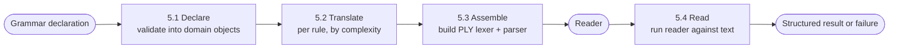

# Core Domain Distillation — Tiferet-Ly (Lex/Yacc Wrapper)

**Status:** Draft · **Domain:** `tiferet-ly` · **Code:** `tiferet_ly/` · **Branch:** `docs-core-domain-vision-statement-and-distillation`
**Companion:** `docs/domain-vision.md`

## 1. Purpose of this document
This document is the technical companion to the vision statement: it says how
Tiferet-Ly is meant to work — its vocabulary, the bounded steps that turn a
declared language into a working reader, how its pieces relate to the wider
Tiferet framework and to the third-party engine it wraps, and where the
design is still open.

Tiferet-Ly does not yet have an implementation: at the time of writing, the
repository contains only a license, a README, and this pair of documents.
Every claim below is therefore either (a) a verified fact about the behavior
of Python Lex-Yacc (PLY), the open-source library this component wraps,
drawn from PLY's own documented conventions, or (b) a verified fact about the
current Tiferet framework (v2.0.0b16) this component is built on, cited to
the exact file and line in the local `tiferet` checkout. Nothing below
describes existing `tiferet-ly` code, because none exists yet; this
document's job is to give a first implementation something precise to be
measured against, and a reviewer something precise to hold it to.

## 2. The core domain, restated precisely
Tiferet-Ly's core domain is **turning a declared small language — its
vocabulary and its sentence structure — into a working reader for text
written in that language, by translating the declaration into the exact form
PLY requires.**

PLY (`ply.lex` and `ply.yacc`) already does the hard, well-tested work of
recognizing words and sentence patterns; it just insists on being told the
rules in a very particular, code-shaped way — as module-level functions and
string variables that follow strict naming and docstring conventions of
PLY's own design. Tiferet-Ly's job is to sit in front of that convention: a
consumer declares a language once, and Tiferet-Ly is responsible for
producing whatever functions and values PLY actually needs, correctly, every
time.

The domain has one fixed shape:

> **Declare** → **translate** → **assemble** → **read**

and three axes of variation:

1. **Rule complexity** — whether a single word or sentence rule is pure
   declaration (a literal pattern, nothing else) or carries a small piece of
   executable logic alongside its pattern. This axis applies independently
   on both sides of the domain (5.2's translation of both token rules and
   productions).
2. **Lexical vs. syntactic** — whether a rule governs how raw characters are
   grouped into words (a *lexical* or *token* rule, PLY's `t_*` convention)
   or how a sequence of already-recognized words is accepted as a valid
   sentence (a *syntactic* or *grammar* rule, PLY's `p_*` convention). The
   two sides share the complexity axis above but not their PLY-imposed
   conventions — see 5.2's entanglement note and Section 8.
3. **Declared language** — which specific small language (which words, which
   sentence patterns, which of the above rules are simple or complex) is
   being described in any one use of Tiferet-Ly. The wrapper itself must
   remain indifferent to this axis; nothing about the translation or
   assembly behaviors may assume a particular language's vocabulary or
   grammar.

## 3. Ubiquitous language
**PLY** — Python Lex-Yacc, the third-party library (`ply.lex`, `ply.yacc`)
that does the actual word-recognition and sentence-recognition work
Tiferet-Ly wraps. Not part of Tiferet; treated as infrastructure.

**Token** — one recognized word: a name (e.g. `NUMBER`, `PLUS`) plus the
literal text PLY matched for it.

**Token rule** — a declaration of how one kind of token is recognized: a
name, and either a raw pattern or a pattern plus a small action (Section 2,
axis 1). In PLY terms, a token rule is realized as a `t_<NAME>` module
attribute.

**Grammar production** (production, for short) — a declaration of how a
sequence of tokens and/or other productions forms a larger structure. In PLY
terms, a production is realized as a `p_<name>` function whose docstring
names the grammar pattern it recognizes.

**Simple rule** — a token rule or production whose declaration is nothing
but its pattern (a regular expression for a token, a grammar spec string for
a production); it carries no executable action of its own.

**Complex rule** — a token rule or production whose declaration pairs a
pattern with a small block of executable logic that runs whenever the rule
matches (converting matched text to a number, building a piece of structured
output, and so on).

**Grammar declaration** — the complete, declared description of one small
language: its full catalogue of token rules and productions, together. This
is what a consumer of Tiferet-Ly writes; it is the input to the domain's
Declare step.

**Docstring-carried pattern** — PLY's own governing convention: PLY does not
read a token's or production's pattern from an argument or a config value,
it reads it from the Python `__doc__` string attached to the function (or,
for the simplest tokens, from a plain string variable) that represents the
rule. A rule PLY cannot find a docstring for is silently skipped rather than
rejected — the single most important constraint the translate step in 5.2
exists to satisfy correctly on a declarer's behalf.

**Reader** — the assembled, ready-to-use pair of a built PLY lexer and a
built PLY parser for one grammar declaration; the thing Tiferet-Ly ultimately
hands back to a consumer.

**DomainObject** — Tiferet's shared, read-only base every domain model
builds on (`tiferet/domain/core.py:242`); the natural base for representing
a declared token rule or production as data before it is translated.

**DomainEvent** — Tiferet's instantiate-and-execute contract for a unit of
business logic (`tiferet/events/core.py:18`); the natural shape for each of
the behaviors in Section 5.

**Service** — Tiferet's unified abstract contract for a swappable
infrastructure concern (`tiferet/interfaces/core.py:165`); the natural
boundary between Tiferet-Ly's own logic and PLY itself, so that logic never
imports `ply` directly.

**Aggregate / TransferObject** — Tiferet's mutation and serialization halves
of a domain model, respectively (`tiferet/mappers/core.py:26`,
`tiferet/mappers/core.py:92`); the natural pair for a grammar declaration
that is both edited in memory and round-tripped to a YAML file.

**ConfigurationRepository** — Tiferet's format-agnostic base for a
file-backed repository (`tiferet/repos/core.py:22`); the natural base for
the repository that reads and writes a grammar declaration file.

## 4. What the domain reads / operates on
A grammar declaration is the domain's primary input. It names two
catalogues — token rules and productions — each keyed by the rule's own
name/id, following PLY's own naming discipline (a token rule's key is the
bare token name PLY expects after the `t_` prefix; a production's key is the
bare rule name PLY expects after the `p_` prefix). Within each catalogue, a
given entry is either a simple rule (a bare pattern) or a complex rule (a
pattern plus an action), per the complexity axis in Section 2.

Two PLY-imposed conventions give this input its actual leverage, and any
declaration format the domain adopts has to respect them rather than paper
over them:

**The token catalogue must be complete before a reader is assembled.** PLY
validates every token rule name it finds against a single, fully populated
list of every token name the language uses; a token rule with no matching
entry in that list — or a grammar reference to a token absent from it —
fails at build time, not at read time. A grammar declaration is therefore
only ever meaningful as a whole; assembling a reader from a partial
declaration is not a smaller version of the same behavior, it is an
unsupported one.

**Rule order carries meaning on the lexical side that it does not carry on
the syntactic side.** PLY matches function-based token rules in the order
they are presented to it, and only sorts pattern-only (simple) token rules
by longest-pattern-first; a declaration format that lets a complex rule and
a simple rule quietly reorder relative to each other during translation
would change what the resulting reader actually accepts, silently.
Productions carry no equivalent ordering constraint from PLY itself (their
disambiguation is a separate concern — precedence and associativity — that
this document does not resolve; see Section 10).

At read time, the domain also operates on the raw text supplied to the
assembled reader, and produces whatever structured result the declaration's
own actions choose to build — the domain has no opinion on that result's
shape.

## 5. The behaviors
Tiferet-Ly's work divides into four bounded steps. Every named event below is
a proposed shape, not existing code — see Section 1.

### 5.1 Declaring a language
*Turn a grammar declaration (however it is authored — YAML is the presumed
format, given Tiferet's own `ConfigurationRepository` convention) into
validated domain objects.*

A repository extending `ConfigurationRepository` (`tiferet/repos/core.py:22`)
would read the declaration file; a `DomainEvent` (in the shape of
`tiferet/events/core.py:18`) would validate it and construct one
`DomainObject` per declared token rule and production, branching on the
complexity axis (Section 2) to produce the simple or complex variant of
each. Produces: a validated in-memory grammar declaration, ready for
translation.

**Verdict:** fully agnostic to the declared-language axis — this step's job
is exactly to accept any language's vocabulary and grammar. Variable only in
how strictly it validates a specific declaration format, which is itself an
open question (Section 10).

### 5.2 Translating a declared rule into PLY's expected shape
*Turn one declared token rule or production into the literal function or
string PLY's own conventions require.*

For a simple token rule, translation is close to an identity operation: the
declared pattern becomes the value PLY expects directly. For a complex token
rule or any production, translation must synthesize a callable whose
docstring carries the declared pattern (per Section 3's
docstring-carried-pattern convention) and whose body runs the declared
action against the argument PLY will pass it — a token or grammar-production
value object that keeps its own mutations. This is the step where a
declarer's intent (a pattern, an action) becomes something that satisfies a
third-party library's own conventions, and it is the one behavior most
exposed to PLY's own constraints from Section 4 rather than to anything
Tiferet defines.

**Verdict:** this is where the rule-complexity axis lives — a simple rule and
a complex rule are translated differently — and it must remain strictly
agnostic to the lexical-vs-syntactic axis's *ordering* constraint (Section 4)
even though the two sides use different PLY-facing conventions (`t_*` vs.
`p_*`).

### 5.3 Assembling a reader
*Turn a complete set of translated rules into a built PLY lexer and parser.*

This step calls PLY's own construction entry points (`lex.lex()`,
`yacc.yacc()`) against the translated rules from 5.2, having first satisfied
Section 4's completeness requirement (the full token list, not a partial
one). A `Service` (`tiferet/interfaces/core.py:165`) would front PLY here,
so nothing above this step imports `ply` directly, mirroring how the
framework itself keeps a `ConfigurationRepository` (`tiferet/repos/core.py:22`)
as the sole thing that imports a file-format loader. Produces: a reader
(Section 3), or a raised error naming which declared rule PLY rejected and
why.

**Verdict:** agnostic to the declared-language axis and to the
rule-complexity axis alike — by the time this step runs, every rule already
looks like a plain PLY-shaped function or value; this step doesn't know or
care which rules started out simple or complex.

### 5.4 Reading text
*Run a built reader against a piece of text and hand back a structured
result.*

Invokes the assembled parser (which itself drives the assembled lexer as PLY
normally does) against supplied input, and returns whatever the
declaration's own complex-rule actions constructed along the way, or
surfaces a recognition failure naming where reading stopped.

**Verdict:** fully agnostic to all three axes named in Section 2 — reading
text is the one behavior that looks identical no matter which language was
declared, and no matter how any of its rules were shaped.

## 6. How the behaviors compose
5.1 and 5.2–5.3 run once per declared language, producing a reusable reader;
5.4 then runs once per piece of text read against that reader, arbitrarily
many times, without repeating declaration or translation.

## 7. Relationships / cross-boundary rules
Tiferet-Ly's own units would sit inside the same layered discipline the
framework itself follows: a `DomainObject` for a declared rule depends on
nothing (`tiferet/domain/core.py:242`); a `DomainEvent` implementing 5.1 or
5.2 depends on that domain object plus, for 5.3, a `Service` contract rather
than PLY directly (`tiferet/events/core.py:18`,
`tiferet/interfaces/core.py:165`); a `ConfigurationRepository`-based
repository sits at the bottom, resolved into the graph the same way the
framework resolves its own YAML repositories, never imported by the events
it feeds directly.

The one relationship this domain adds that the framework's own core domain
does not have is a dependency on a specific piece of *external, un-owned*
infrastructure whose conventions cannot be renegotiated: PLY. Every other
Tiferet `Service` wraps infrastructure whose contract Tiferet itself can
shape through its own interface; here, the shape on the other side of the
`Service` boundary is fixed by a third-party library's own design choices
(Section 3's docstring convention, Section 4's ordering and completeness
rules). Judging whether a proposed translation (5.2) is correct is
therefore not a judgment Tiferet-Ly can make from its own conventions
alone — it always requires PLY's actual, specific expectations as an input,
which is why Sections 3 and 4 above are written as direct claims about PLY
rather than paraphrased through Tiferet's own vocabulary.

## 8. The agnostic core and the variable edge
**Agnostic — built once, shared by every declared language:**
- The four-step pipeline itself (Section 6).
- Reading text against an already-assembled reader (5.4) — identical
  regardless of the declared language or any rule's complexity.
- Reader assembly (5.3), once rules have been translated.
- The rule-complexity branch in translation (5.2) as a *mechanism* — simple
  and complex rules are always translated by the same two code paths,
  whatever language declared them.

**Variable — one definition per declared language:**
- The full token and production catalogue itself: which words and sentence
  patterns exist at all.
- Which individual rules are simple versus complex, and what a complex
  rule's action actually does with a matched token or a recognized
  production.
- Whatever structured result a language's actions choose to build during
  5.4 — Tiferet-Ly imposes no shape on it.

**Currently entangled — the honest inventory:**

Because no implementation exists yet (Section 1), there is no code-level
entanglement to report today. The honest content of this section is instead
the entanglement this design is already at risk of accumulating on first
implementation, named now so a first PR can be judged against it rather than
discovering it after the fact:
- **The ordering constraint in Section 4 is real for PLY but easy to lose in
  a config-driven translation.** A declaration format such as YAML has no
  inherent order guarantee across all parsers and versions the way a
  hand-written sequence of Python functions does; a first implementation
  that iterates a loaded declaration's token rules without deliberately
  preserving and honoring declared order would silently reintroduce the
  exact ambiguity PLY's own convention exists to avoid, and the failure
  would show up as a misread token, not a translation error.
- **Complex-rule actions are, necessarily, executable code supplied by
  whoever authors a declaration.** Whatever mechanism 5.2 uses to run a
  complex rule's action (compiling and executing a supplied code fragment is
  the most direct approach) makes the boundary between "declaring a
  language" and "supplying arbitrary executable logic" thin by construction.
  This is not a defect to fix; it is a property of the domain that should be
  named in any TRD that specifies 5.2, rather than discovered when the first
  complex rule containing a mistake produces a confusing failure.

## 9. Boundaries
**Inside the domain:** accepting a declared language's vocabulary and
grammar, translating that declaration into PLY's own required shape,
assembling a working reader from it, and running that reader against
supplied text to produce a structured result or a recognition failure.

**Outside the domain:**
- Deciding what a specific language's words and sentence patterns *mean*, or
  what should happen with a structured result once produced — owned
  entirely by whoever authors a grammar declaration and consumes
  Tiferet-Ly's output, not by Tiferet-Ly.
- PLY's own word- and sentence-recognition behavior — owned by PLY itself;
  Tiferet-Ly translates and assembles, it does not reimplement or alter what
  PLY is able to recognize.
- General Tiferet application composition (declaring sessions, services, and
  workflows unrelated to reading a language) — owned by the core `tiferet`
  framework's own Declare → resolve → execute → respond domain, which this
  component is built on but does not extend.

## 10. Where this leads
1. **Author the TRD defining the grammar declaration format.** The exact
   YAML shape for the token and production catalogues — including how
   declared order is represented and preserved — needs to be specified and
   validated against PLY's real ordering and completeness constraints
   (Section 4) before any domain object design is finalized.
2. **Author the TRD for the domain object and mapper layer.** The
   simple/complex `DomainObject` hierarchy for token rules and productions,
   plus their `Aggregate`/`TransferObject` pair for round-tripping a
   declaration to and from its file, following `tiferet/mappers/core.py:26`
   and `tiferet/mappers/core.py:92`.
3. **Author the TRD for the translation service (5.2).** In particular, how
   a complex rule's action is turned into running code safely, and how the
   ordering entanglement named in Section 8 is prevented rather than merely
   documented.
4. **Author the TRD for the assembly and read events/interfaces (5.3–5.4).**
   Including the `Service` contract that keeps PLY itself behind a
   swappable boundary, and the test harness these events would use,
   following Tiferet's own `DomainEvent`-testing convention
   (`tiferet/events/core.py:18`).

Each is independently scopeable, and together they are the actual first
implementation this pair of documents is meant to be measured against.
